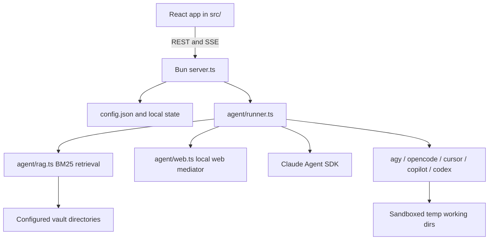

# Developer Onboarding Guide: Vault Assistant

This guide is for developers and AI coding agents working in this repository. It
summarizes what the app does, how the major pieces fit together, how to run it,
and where to make common changes.

Before changing code, also read [docs/WORKFLOW.md](docs/WORKFLOW.md). That file
is the active agent workflow for this repo and requires tests for new features or
pipeline changes.

## 1. Product Overview

Vault Assistant is a local Bun + React application that connects a user's
knowledge vault, such as an Obsidian markdown directory, to one of several LLM
engines. It is designed for grounded vault Q&A, job-application drafting, and
writing new notes back into the vault.

Important privacy boundary: the app process runs locally and reads files from
the configured vault locally, but the selected model engine may still send prompt
text and retrieved vault excerpts to its provider. Claude Code uses the Claude
Agent SDK. CLI engines run from temporary sandbox directories and receive vault
content as read-only prompt text, not direct filesystem access.

Supported engines are defined in [shared/settings.ts](shared/settings.ts) and
[agent/config.ts](agent/config.ts):

- Claude Code through `@anthropic-ai/claude-agent-sdk`
- Gemini Antigravity through the `agy` CLI
- OpenCode through the `opencode` CLI
- Cursor Agent through `cursor-agent` or `cursor agent`
- GitHub Copilot through the `copilot` CLI
- Codex through the `codex` CLI

## 2. Quick Start

Prerequisites:

- Bun 1.3 or newer
- Claude Code installed and authenticated, or `ANTHROPIC_API_KEY` configured for
  Claude usage
- Any optional CLI engines installed on `PATH` if you want to use them

Run the app:

```bash
./run.sh
```

Equivalent manual commands:

```bash
bun install
bun run dev
```

The default URL is `http://localhost:5173`. If that port is already in use, set
`PORT`:

```bash
PORT=5174 ./run.sh
```

`run.sh` also loads a local `.env` file when present. Useful variables include:

- `PORT` - dev server port, default `5173`
- `VAULT_DIR` - default vault path when no `config.json` exists
- `ANTHROPIC_API_KEY` - optional fallback for Claude access

First-run onboarding appears when the saved server config has
`onboarded: false`, which is the default when `config.json` is missing. The modal
collects name, role, vault path, optional voice notes, and a generated job-mode
system prompt. Older `config.json` files without an `onboarded` field are treated
as already onboarded by [agent/config.ts](agent/config.ts).

Optional local web research setup:

```bash
bunx playwright install chromium
docker run --rm --name vault-searxng -p 127.0.0.1:8080:8080 searxng/searxng:latest
```

SearXNG must have JSON output enabled in its `settings.yml`:

```yaml
search:
  formats:
    - html
    - json
```

Then enable the Web-search research pre-packaged skill under Settings -> Skills
and set the loopback SearXNG URL under Settings -> RAG / Retrieval.

## 3. Product Modes

Each tab can switch modes from the mode bar in
[src/components/TabView.tsx](src/components/TabView.tsx).

### Ask the Vault

Ask mode is the default. It takes a question and produces a vault-grounded
answer. With RAG disabled, Claude Code can read the vault with `Read`, `Grep`,
and `Glob`; CLI engines receive a bounded vault context bundle. With RAG enabled,
the app injects retrieved excerpts and restricts file browsing for Claude.

Ask follow-ups resume the tab's prior Claude session, or pass the previous answer
back into the prompt for CLI engines. If Humanize is enabled, Ask answers also
get a humanize rewrite pass.

### Drafting Mode

Drafting mode is the job/application workflow. It takes optional context or a job
description plus a specific question, then runs:

1. Draft turn: create a grounded first-person answer.
2. Humanize turn: if enabled, rewrite the draft using the humanizer skill or
   inline humanize rules for CLI engines.
3. Follow-up turns: revise the existing answer while preserving the tab session.

The prompt is generic to the configured vault. Any user-specific folders in a
local `config.json` persona are user data, not a hardcoded repository contract.

### Write to Vault

Write mode is a separate Vault Writer workflow in
[src/components/VaultWriter.tsx](src/components/VaultWriter.tsx). It is selected
per tab; the Settings default-mode control currently exposes Ask and Drafting
mode for new tabs.

Write mode has three submodes:

- Summarize: summarize pasted text or an imported URL into markdown.
- Manual: write note content manually, then optionally clean up, auto-place, and
  save it.
- Fill-in: scan the vault for documentation gaps, draft entries from user
  answers, and save approved drafts.

The app does not write a generated preview to disk until the user confirms. The
actual write goes through `/api/vault/write`, which verifies the destination is
inside the configured vault.

## 4. Architecture and Request Flow

The project is a lightweight monolith driven by one Bun process.



Core server routes live in [server.ts](server.ts):

- `/api/meta` - available models, engines, and defaults
- `/api/config` - load and save durable settings
- `/api/logs` - durable activity log
- `/api/usage` - Claude Code usage data
- `/api/skills/status`, `/api/skills/list`, `/api/skills/generate`,
  `/api/skills/create` - skill discovery and authoring
- `/api/vault/validate`, `/api/vault/tree`, `/api/vault/write` - vault checks,
  directory browsing, and confirmed writes
- `/api/fetch-url` - URL extraction for Vault Writer imports
- `/api/tabs/:id/generate` - Ask and Drafting generation
- `/api/tabs/:id/message` - Ask and Drafting follow-ups
- `/api/tabs/:id/cleanup` - answer-card cleanup
- `/api/tabs/:id/summarize`, `/api/tabs/:id/auto-place`,
  `/api/tabs/:id/fillin-scan`, `/api/tabs/:id/fillin-write`,
  `/api/tabs/:id/write-cleanup` - Vault Writer turns
- `/api/tabs/:id/cancel` - cancel in-flight work

Long-running model calls stream named SSE events back to the browser:
`phase`, `text`, `activity`, `draft`, `notice`, `done`, and `error`.

The frontend API wrapper is [src/lib/api.ts](src/lib/api.ts). Conversation
actions for Ask/Drafting mode are in
[src/lib/conversation-actions.ts](src/lib/conversation-actions.ts). Writer
actions are owned by [src/App.tsx](src/App.tsx).

## 5. Key Files

- [server.ts](server.ts) - Bun server, static app serving, REST routes, SSE
- [agent/runner.ts](agent/runner.ts) - generation, follow-up, cleanup, writer,
  and skill-authoring orchestration
- [agent/config.ts](agent/config.ts) - defaults, model/engine lists, prompt
  builders, config persistence
- [agent/gemini.ts](agent/gemini.ts) - shared CLI engine driver despite the
  historic filename
- [agent/rag.ts](agent/rag.ts) - pure TypeScript BM25 retrieval and chunking
- [agent/web.ts](agent/web.ts) - local SearXNG search, URL reads, SSRF guards,
  Readability, and Playwright fallback
- [agent/skills.ts](agent/skills.ts) - skill discovery, loading, parsing, and
  creation
- [agent/logs.ts](agent/logs.ts) - durable activity log persistence
- [agent/usage.ts](agent/usage.ts) - Claude usage integration
- [agent/agent.test.ts](agent/agent.test.ts) - main Bun test suite
- [shared/settings.ts](shared/settings.ts) - shared settings, engines, tab modes,
  model/reasoning normalization
- [shared/persona.ts](shared/persona.ts) - Ask and Job persona builders
- [shared/design.ts](shared/design.ts) - fun background variant list
- [shared/prepackaged-skills.ts](shared/prepackaged-skills.ts) - built-in skill
  toggles shown in Settings
- [src/App.tsx](src/App.tsx) - app shell, global state, tabs, logs, settings,
  writer handlers
- [src/components/TabView.tsx](src/components/TabView.tsx) - per-tab mode UI
- [src/components/VaultWriter.tsx](src/components/VaultWriter.tsx) - Write mode
- [src/components/SettingsPanel.tsx](src/components/SettingsPanel.tsx) -
  settings drawer
- [src/components/FunBackground.tsx](src/components/FunBackground.tsx) -
  animated background renderer
- [src/lib/store.ts](src/lib/store.ts) - client-side tab/settings/log storage
- [src/styles.css](src/styles.css) - design tokens, layout, themes, component CSS

Additional docs:

- [docs/architecture.md](docs/architecture.md)
- [docs/rag.md](docs/rag.md)
- [docs/web-research.md](docs/web-research.md)
- [docs/design.md](docs/design.md)
- [docs/WORKFLOW.md](docs/WORKFLOW.md)

## 6. Retrieval, Skills, and Web Research

RAG is implemented in [agent/rag.ts](agent/rag.ts). It chunks markdown/text,
scores chunks with BM25, and returns up to about 8 chunks or 12 KB by default.
When no chunks match, the runner falls back to the normal non-RAG context path
and emits a UI notice.

Context delivery differs by engine:

| Setting | Claude Code | CLI engines |
| --- | --- | --- |
| RAG off | Claude may use `Read`, `Grep`, and `Glob` in the vault. | The app gathers up to about 150 KB of markdown/text context and sends it in the prompt. |
| RAG on | Retrieved excerpts are injected and file tools are disabled. | Retrieved excerpts replace the whole-vault context bundle. |

Skills are discovered from `~/.claude/skills` and
`<vault>/.claude/skills`. Selected user skills are embedded into the prompt for
Claude and every CLI engine, so they do not depend on a provider-specific native
skill system. The Claude native `Skill` tool is still allowed where needed,
notably for the humanizer pass.

Pre-packaged skills are toggled in Settings -> Skills:

- Humanize - de-AI rewrite pass, enabled by default.
- Web-search research - gives all engines the same bounded `web_search` /
  `web_read` text protocol through the local server.

Web research is mediated by [agent/web.ts](agent/web.ts). It only accepts a
loopback SearXNG endpoint for search and validates public URL reads, redirects,
DNS results, ports, response size, and extracted text size before returning
external data to a model as untrusted evidence.

## 7. Settings and Persistence

Server-side files:

- `config.json` - durable global settings, gitignored
- `.sessions.json` - tab to Claude session IDs, gitignored
- `logs/activity.jsonl` - durable activity log, gitignored

Browser storage:

- `jt.tabs.v1` - tab state
- `jt.settings.v1` - client settings cache
- `jt.design.v1` - visual settings
- `jt.theme`, `jt.density`, `jt.split`, `jt.defaultmode` - UI preferences

The server configuration is authoritative for first-run onboarding state.
`src/App.tsx` merges server config with local cached settings but preserves the
server's `onboarded` value.

## 8. Development Workflow

Run the test suite before completing work:

```bash
bun test
```

Per [docs/WORKFLOW.md](docs/WORKFLOW.md), new feature work or changes to engine
execution, prompts, settings schemas, retrieval, or backend pipeline behavior
must update [agent/agent.test.ts](agent/agent.test.ts).

Common development commands:

```bash
bun install
bun run dev
bun test
bunx playwright install chromium
```

Common change paths:

- Add an engine: update the `Engine` union and defaults in
  [shared/settings.ts](shared/settings.ts), the `ENGINES` list in
  [agent/config.ts](agent/config.ts), CLI availability and command construction
  in [agent/gemini.ts](agent/gemini.ts), and tests in
  [agent/agent.test.ts](agent/agent.test.ts).
- Add or change prompt behavior: update builders in
  [agent/config.ts](agent/config.ts), orchestration in
  [agent/runner.ts](agent/runner.ts) if needed, and tests.
- Add a fun background: add the variant in [shared/design.ts](shared/design.ts),
  implement canvas/CSS behavior in
  [src/components/FunBackground.tsx](src/components/FunBackground.tsx) and
  [src/styles.css](src/styles.css), then test the UI.
- Change settings UI: update shared settings types/defaults first, then
  [src/components/SettingsPanel.tsx](src/components/SettingsPanel.tsx), and
  ensure server/client normalization still agrees.
- Change Write mode: update [src/components/VaultWriter.tsx](src/components/VaultWriter.tsx),
  [src/App.tsx](src/App.tsx), related routes in [server.ts](server.ts), prompt
  builders in [agent/config.ts](agent/config.ts), and tests where behavior changes.

## 9. Verification Checklist

For a documentation-only change, at minimum run:

```bash
bun test
```

For changes that can affect runtime behavior, also smoke-test the server:

```bash
PORT=5174 bun run dev
curl -i http://127.0.0.1:5174/api/meta
curl -i http://127.0.0.1:5174/
```

Expected results: both requests return HTTP 200, `/api/meta` includes the model
and engine lists, and `/` returns the app HTML.
