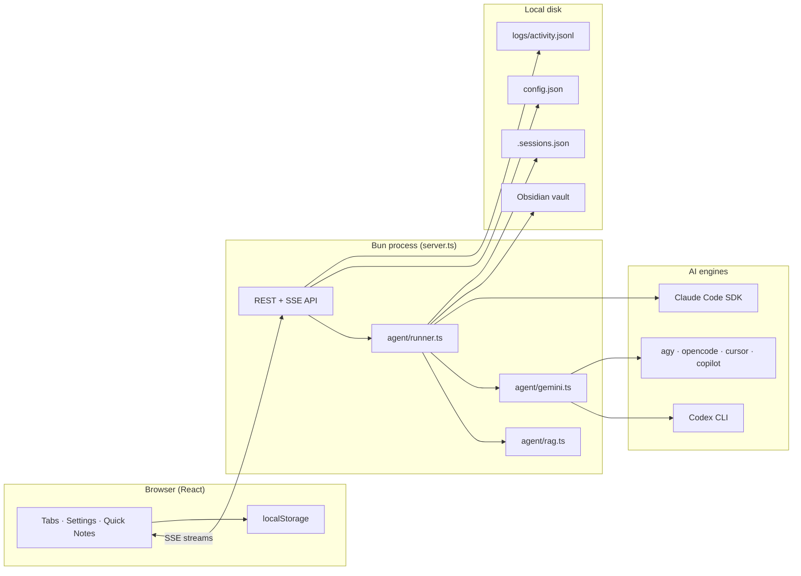

# Vault Assistant — Documentation

High-level docs for what this project is and how it works. For setup and the
quickstart, see the top-level [`../README.md`](../README.md).

## What it is

A local web app for working with an Obsidian vault through multiple AI engines.
Each **tab** is an independent conversation with its own engine override, skills,
RAG toggle, and (for Claude) persisted session. Three tab modes cover different
workflows:

| Mode | Purpose |
| --- | --- |
| **Ask** (default) | Ask questions grounded in the vault. One answer turn, no humanize pass. |
| **Job** | Paste a job description + application question; draft a first-person answer, then humanize it. |
| **Write** | Create or extend vault notes: summarize URLs, write manually, or fill in gaps the vault is missing. |

Everything runs locally on [Bun](https://bun.sh): one process serves the React
UI and a JSON + SSE API, and drives the model.

## The pieces

| Area | File(s) | Role |
| --- | --- | --- |
| Server | `server.ts` | Bun server: serves the UI, exposes the API, streams results over SSE. |
| Agent pipeline | `agent/runner.ts` | Ask / Job / Write pipelines; session per tab; cleanup and follow-up turns. |
| Config & prompts | `agent/config.ts` | Defaults, model list, personas, and prompt builders for every mode. |
| Retrieval (RAG) | `agent/rag.ts` | Pure-Bun BM25 retrieval over the vault. See [rag.md](rag.md). |
| Engines | `agent/gemini.ts` | CLI engines (Gemini Antigravity, OpenCode, Cursor Agent, GitHub Copilot, Codex) plus vault context gathering. |
| Skills | `agent/skills.ts` | Discovers skills (`~/.claude/skills` + vault `.claude/skills`), creates new ones, detects `humanizer`. Claude invokes via `Skill` tool; Codex gets inline `SKILL.md` text. |
| Usage | `agent/usage.ts` | Reads Claude Code subscription usage for the Settings panel. |
| Activity log | `agent/logs.ts` | Durable JSONL log of generations (`logs/activity.jsonl`). |
| UI | `src/` | React app: tabs, settings, Vault Writer, Quick Notes, activity log, answer stream. |

## Docs in this folder

- [architecture.md](architecture.md) — process model, tab modes, API, SSE events, engines.
- [rag.md](rag.md) — the RAG retrieval feature and the **RAG** toggle.
- [design.md](design.md) — the design system, tokens, theming, and components.

## Key ideas

- **Grounded, never fabricated.** Answers are built only from what the vault
  actually says. If the vault doesn't support a claim, it's left out.
- **Three tab modes.** Ask for Q&A, Job for applications, Write for note creation.
- **Multiple engines.** Claude Code (default), Codex, or the other supported CLI engines.
- **RAG to save tokens.** Toggle **RAG** on a tab to send only the most relevant
  vault excerpts instead of reading or dumping the whole vault.
- **Local and private.** Your vault never leaves your machine; the app reuses
  your existing Claude Code login (or `ANTHROPIC_API_KEY`).
