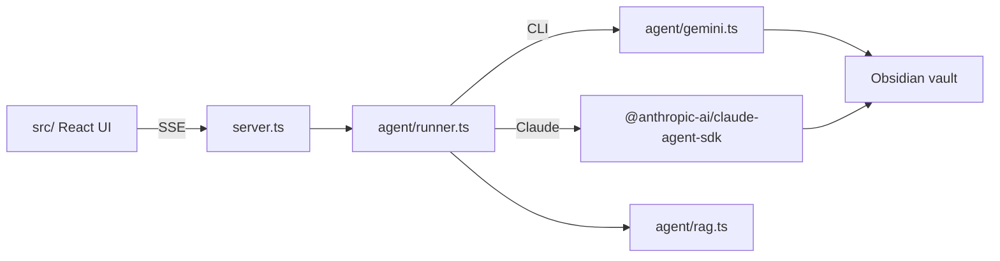

# Vault Assistant Agent Workflow

Welcome to the **Vault Assistant** development guide! This document is designed to streamline the workflow for AI agents and developers working on this project.

## Core Architecture

Vault Assistant is a specialized web UI and backend system designed to harness various LLM CLIs (Command Line Interfaces) and the Claude Agent SDK, seamlessly feeding them context from a user's vault (e.g., Obsidian) and displaying responses in a highly stylized, interactive interface.

### 1. Tab modes

Each tab has a `TabMode` in `src/lib/store.ts` and `agent/config.ts`:

| Mode | UI | Pipeline |
| --- | --- | --- |
| `ask` | Question input + AnswerStream | Single draft turn; follow-ups via `followUp()` |
| `job` | Job description + question | Draft → humanize; follow-ups + cleanup |
| `write` | `VaultWriter.tsx` | summarize / auto-place / fill-in endpoints; vault write on confirm |

When adding features, decide which mode(s) they apply to and update both the UI
(`TabView.tsx`, `VaultWriter.tsx`) and the runner (`agent/runner.ts`).

### 2. CLI Engine Compatibility

The core strength of the Assistant is its ability to interface with multiple AI CLI tools:

- **Claude Code** — `@anthropic-ai/claude-agent-sdk` (default)
- **Codex** — `codex exec`
- **Gemini Antigravity** — `agy`
- **OpenCode** — `opencode`
- **Cursor Agent** — `cursor`
- **GitHub Copilot** — `copilot`

CLI engines are managed in `agent/gemini.ts`. The `runCliTurn` function is the unified executor that pipes standard input/output for any of the non-Claude agents. It automatically detects which tools are installed and available on the user's `PATH`.

Claude and Codex support selected skills (Claude via `Skill` tool, Codex via inline `SKILL.md`). Other CLI engines skip selected skills and use inline humanization rules.

### 3. UI and Styling

The UI is built with React. It supports dynamic background themes (found in `src/components/FunBackground.tsx`) and CSS-driven layout management.

- **Settings:** Organized into sub-headings (`General Preferences`, `AI Engine & Models`, `Generation & Retrieval`, `Vault & Context`, `Persona Prompt`, `Design`, `Skills`).
- **Fun Backgrounds:** Canvas-based renderers and CSS themes (Aurora, Matrix Rain, Balatro, etc.). Changes apply via `data-*` attributes on `document.documentElement`.
- **Design settings:** Font family, accent hue, border radius, spacing, and shadow intensity — see `DesignSettings` in `src/lib/store.ts` and `docs/design.md`.

## Development Workflow

### Test-Driven Development (CRITICAL)

**All new requests and features must be accompanied by a test.**

We utilize `bun test` as our primary testing framework. The core testing suite is located in `agent/agent.test.ts`.
When you add a new feature (such as a new CLI engine, a new prompt builder, or modifying execution logic), you *must* add or update a test in the suite to audit that the feature works accordingly.

1. **Write the Code:** Implement your feature or bug fix.
2. **Update the Tests:** Open `agent/agent.test.ts` and add a new `test(...)` block or update an existing one to cover your changes.
3. **Run the Tests:** Execute `bun test` to ensure your new test passes and no existing tests are broken.

### Adding a New CLI Engine

1. Update the `Engine` type and `ENGINES` array in `agent/config.ts` and `src/lib/store.ts`.
2. Add detection logic in `agent/gemini.ts` (`cliAvailable`, `buildCliCommand`).
3. Ensure the unified `runCliTurn` executor can handle the new engine's I/O structure.
4. Expose availability in `server.ts` `/api/skills/status`.
5. **Update `agent/agent.test.ts`** to audit the new engine detection and execution logic.

### Adding a Write-Mode Feature

1. Add prompt builders in `agent/config.ts` if needed.
2. Add a pipeline function in `agent/runner.ts` (follow existing `summarize`, `fillinScan`, etc.).
3. Register the SSE route in `server.ts`.
4. Wire the UI in `VaultWriter.tsx` and the handler in `src/App.tsx`.
5. **Update `agent/agent.test.ts`** for any new prompt builders or CLI command shapes.

### Adding a New Fun Background

1. Add the rendering logic (Canvas or CSS) to `src/components/FunBackground.tsx` and `src/styles.css`.
2. Update the `FunVariant` type in `src/lib/store.ts`.
3. Ensure the Settings panel (`src/components/SettingsPanel.tsx`) lists the new background.

## Best Practices

- **Documentation:** Keep `docs/architecture.md` and this workflow document updated if architectural shifts occur.
- **CSS Checks:** Always verify that layout structure (like the settings drawer) is not broken when introducing new UI elements or themes.
- **Vault writes:** Always go through `POST /api/vault/write` with path validation — never write arbitrary paths from the client.
