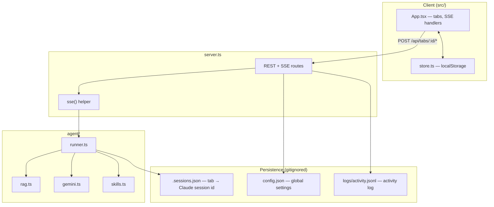
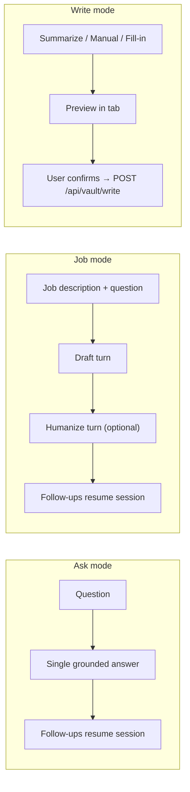
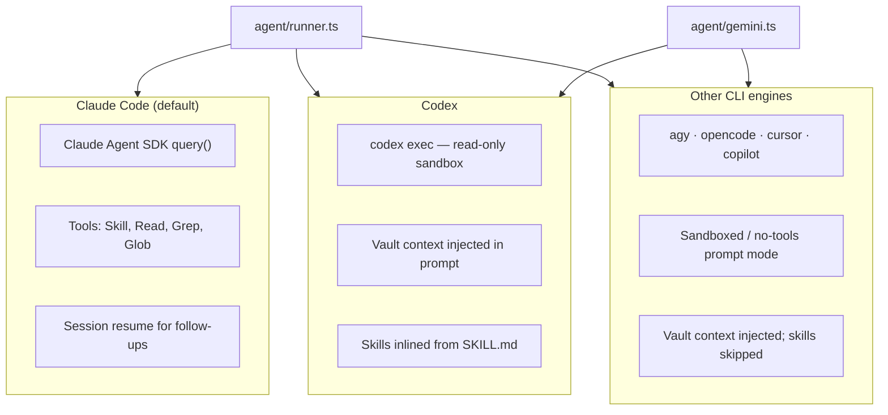

# Architecture

How a request becomes an answer — and how vault writes reach disk.

## Process model

One Bun process does everything:

- `Bun.serve` in `server.ts` serves the React app (`src/index.html`, bundled by
  Bun) and a small API.
- The same process runs the agent pipeline in `agent/runner.ts`.
- Long generations stream back to the browser as Server-Sent Events (SSE).

There is no separate build step and no database.

## Tab modes

Each tab has a `mode`: **ask**, **job**, or **write**. The mode switch lives in
the tab header. Settings defaults new tabs to Ask or Job; Write is selected per tab.

### Ask mode

1. User enters a question and hits **Ask**.
2. `generate()` in `agent/runner.ts` runs a single draft turn with `ASK_PERSONA`.
3. Optional **RAG** retrieves excerpts keyed on the question alone (not the job description).
4. No humanize pass. Follow-ups call `followUp()` and resume the Claude session.

### Job mode

1. User pastes a job description and question, hits **Generate**.
2. **Draft turn** — grounded first-person answer using `DEFAULT_PERSONA` (or custom persona).
3. **Humanize turn** — runs the `humanizer` skill when enabled (Job mode only).
4. Follow-ups resume the same session. **Clean up** runs a lightweight Haiku turn without disturbing the session.

### Write mode

Write mode replaces the job/ask inputs with `VaultWriter.tsx`. Three sub-modes:

| Sub-mode | Endpoint | What it does |
| --- | --- | --- |
| **Summarize** | `POST /api/tabs/:id/summarize` | Condense pasted text or a fetched URL into markdown. User picks a save path and confirms. |
| **Manual** | `POST /api/tabs/:id/auto-place`, `/write-cleanup` | Write a note by hand; optionally **Auto-place** (suggest vault path) or **Clean up** (format markdown). |
| **Fill-in** | `POST /api/tabs/:id/fillin-scan`, `/fillin-write` | Scan the vault for gaps, answer questions, draft formatted content per question. |

Nothing touches the vault until the user confirms. Saves go through
`POST /api/vault/write`, which resolves paths under `vaultDir` and rejects escapes.

URL inputs in Summarize mode are fetched server-side by `POST /api/fetch-url`
before summarization.

## A request, end to end (Ask / Job)

1. **UI** — `src/App.tsx` holds tabs. Each tab has inputs, a per-tab **Skills**
   selection, and toggles (**RAG**, **YC**, settings override). Generate/Ask POSTs
   to `/api/tabs/:id/generate`.
2. **Server** — `server.ts` merges global config with any per-tab override via
   `resolveSettings()`, then calls `generate()` inside an SSE wrapper.
3. **Pipeline** — `agent/runner.ts` branches on `mode` and `engine`:
   - Claude: `query()` from `@anthropic-ai/claude-agent-sdk` with tool access.
   - CLI engines: `runCliTurn()` shells out with injected vault context.
4. **Streaming back** — the runner `emit`s events the UI consumes (see below).

## SSE events

The UI (`streamPost` in `src/lib/api.ts`) listens for these event types:

| Event | Payload | Meaning |
| --- | --- | --- |
| `phase` | `{ phase }` | Current stage: `draft`, `humanize`, `cleanup`, `followup`. |
| `text` | `{ phase, delta }` | Streaming token delta for the answer/preview. |
| `activity` | `{ tool, input }` | Tool use (Read/Grep/Glob/Skill) or RAG source lines. |
| `draft` | `{ text }` | Raw draft before humanize (Job mode). |
| `notice` | `{ message }` | Non-fatal info (RAG fallback, missing skill, etc.). |
| `session` | `{ sessionId }` | Claude session id (for follow-ups). |
| `done` | `{ text, sessionId? }` | Final text for this turn. |
| `error` | `{ message }` | Fatal error; stream ends. |

## Engines

The engine is chosen globally or per tab.

- **Claude Code** (`@anthropic-ai/claude-agent-sdk`) — reuses your existing
  Claude Code auth. By default the agent reads the vault with
  `Read`/`Grep`/`Glob`, and the `Skill` tool runs selected skills.
- **Codex** — shells out to `codex exec` in a read-only sandbox. No direct vault
  access; the app gathers context and inlines selected `SKILL.md` instructions.
- **Other CLI engines** — Gemini Antigravity (`agy`), OpenCode, Cursor Agent,
  and GitHub Copilot run in sandboxed/no-tools mode with injected context.
  Humanization uses inline rules; selected skills are skipped.

Detection and availability are exposed at `GET /api/skills/status`.

## How context reaches the model

Two paths, switched by the **RAG** toggle:

| Mode | Claude Code | CLI engines |
| --- | --- | --- |
| RAG **off** | Agent reads vault on demand (`Read`/`Grep`/`Glob`). | Whole vault gathered (up to ~150 KB) and injected. |
| RAG **on** | Excerpts retrieved and injected; file tools disabled. | Only retrieved excerpts injected. |

RAG query text differs by tab mode: Ask uses the question only; Job combines job
description + question. See [rag.md](rag.md).

## API surface

All generation endpoints return SSE streams. Config and meta endpoints return JSON.

| Route | Method | Purpose |
| --- | --- | --- |
| `/api/meta` | GET | Models, engines, default settings. |
| `/api/config` | GET/POST | Load/save global settings (`config.json`). |
| `/api/logs` | GET/POST/DELETE | Activity log CRUD. |
| `/api/usage` | GET | Claude Code subscription usage. |
| `/api/skills/status` | GET | Installed skills + CLI engine availability. |
| `/api/skills/list` | GET | Full skill list for the picker. |
| `/api/skills/create` | POST | Scaffold a new `SKILL.md`. |
| `/api/vault/validate` | GET | Check vault path and known subdirs. |
| `/api/vault/tree` | GET | Directory tree for path picker (depth 4). |
| `/api/vault/write` | POST | Write a file under the vault (path-validated). |
| `/api/fetch-url` | POST | Fetch and strip HTML for Summarize mode. |
| `/api/tabs/:id/generate` | POST | Ask or Job initial generation. |
| `/api/tabs/:id/message` | POST | Follow-up message. |
| `/api/tabs/:id/cleanup` | POST | Clean up edited answer (Ask/Job). |
| `/api/tabs/:id/cancel` | POST | Abort in-flight generation. |
| `/api/tabs/:id/summarize` | POST | Write mode: summarize content/URL. |
| `/api/tabs/:id/auto-place` | POST | Write mode: suggest vault path. |
| `/api/tabs/:id/fillin-scan` | POST | Write mode: scan for vault gaps. |
| `/api/tabs/:id/fillin-write` | POST | Write mode: format a fill-in answer. |
| `/api/tabs/:id/write-cleanup` | POST | Write mode: clean up manual note text. |

## UI components (selected)

| Component | Role |
| --- | --- |
| `App.tsx` | Root state, SSE handlers, theme/design/split view. |
| `TabView.tsx` | Per-tab layout; switches between ask/job inputs and `VaultWriter`. |
| `AnswerStream.tsx` | Streaming answer display, regenerate, clean up. |
| `VaultWriter.tsx` | Write mode UI (summarize / manual / fill-in). |
| `SettingsPanel.tsx` | Global settings, design prefs, skills, usage panel. |
| `QuickNotes.tsx` | Local scratchpad (profile links, references, copy boxes). |
| `FunBackground.tsx` | Animated background variants. |
| `ActivityLog.tsx` | Per-tab context/tool activity. |

Client state persists in `localStorage` via `src/lib/store.ts`. Global settings
also sync to `config.json` on the server.

## Where things live

- Prompt text and personas — `agent/config.ts`
- Retrieval — `agent/rag.ts`
- CLI execution — `agent/gemini.ts`
- Session persistence — `agent/runner.ts` (`.sessions.json`)
- Activity log — `agent/logs.ts` (`logs/activity.jsonl`)
- Claude Code usage — `agent/usage.ts`
- Client state — `src/lib/store.ts`
- API client (SSE parsing) — `src/lib/api.ts`
