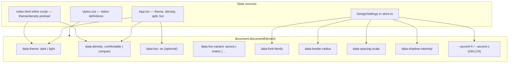

# Design system

The UI follows one design language — a Linear/Vercel-meets-VS-Code aesthetic:
calm surfaces, mono labels, status pills, segmented chips, and a restrained
motion layer. It lives almost entirely in `src/styles.css` as CSS custom
properties, so the look is driven by tokens rather than per-component styling.

## Tokens

All color, type, spacing, radius, and shadow values are CSS variables on
`:root` in `src/styles.css`. Colors are authored in **OKLCH** so tints and
states can be derived with `color-mix(in oklch, …)` instead of hand-picking
hex values.

- **Color** — `--bg`, `--surface`, `--fg`, `--muted`, `--border`, `--accent`
  (links/affordances), `--accent-strong` (primary fills), and the status hues
  `--success` / `--warning` / `--danger`.
- **Type** — `--font-display` (headings), `--font-body` (prose), `--font-mono`
  (labels, meta, logs).
- **Rhythm** — `--space-1…6`, `--radius-1/2/pill`, `--shadow-card`, and a focus
  `--ring`.

## Theming & density

Theme and density are attributes on `<html>`, not React state baked into
components:

- `data-theme="dark" | "light"` — dark is the default identity; light is a full
  first-class palette. Toggled from the ☾/☀ button in the header.
- `data-density="comfortable" | "compact"` — compact tightens the spacing and
  type scale. Toggled from the ▢/▣ button.

Both are persisted to `localStorage` (`jt.theme`, `jt.density`) and applied
before first paint by a tiny inline script in `src/index.html`, so there's no
flash on reload. `App.tsx` mirrors the same values back onto `<html>` and saves
them when they change.

## Design customization

Beyond theme and density, **Settings → Design** exposes `DesignSettings`
(`src/lib/store.ts`). Changes apply via `data-*` attributes and CSS variables on
`<html>`:

| Setting | Attribute / variable | Options |
| --- | --- | --- |
| Font family | `data-font-family` | system, Inter, Roboto, Fira Code, JetBrains Mono, … |
| Font scale | `--font-scale` | 0.85 – 1.15 |
| Accent hue / chroma | `--accent-h`, `--accent-c` | OKLCH sliders |
| Border radius | `data-border-radius` | sharp, rounded, pill, circle |
| Spacing scale | `data-spacing-scale` | compact, comfortable, spacious |
| Shadow intensity | `data-shadow-intensity` | none, subtle, medium, strong |
| Toolbar layout | `toolbarDropdown` | compact dropdown vs. full toolbar row |

Design prefs persist in `localStorage` (`jt.design`). Google Fonts load on demand
via `src/lib/fonts.ts` when a non-system font is selected.

## Components

These class patterns recur; reuse them rather than inventing new ones:

- **`.card` / `.card-h` / `.card-b`** — the standard surface (header + body).
  Used for the input panel and the answer panel.
- **`.pill` (+ `--success` / `--warn` / `--danger` / `--accent`)** — status and
  metadata chips, e.g. the engine/model pills in the header and the phase pill
  on the answer card. Pair with a `.dot` for a leading status dot.
- **`.chip`** — a segmented, checkable control (`:has(input:checked)` lights it
  up). Used for the per-tab **YC**, **RAG**, and **Override** toggles.
- **`.btn` / `.btn-primary` / `.btn-cancel` / `.btn-ghost`** — actions; primary
  is a gradient fill with a single light sweep on hover.
- **`.statusbar`** — the accent-colored footer. Reflects live state: the active
  tab's phase (with a breathing dot while running), engine, RAG, and tab count.

## Motion

Motion is intentionally small and gated behind
`@media (prefers-reduced-motion: no-preference)`: cards rise in, the primary
button gets one light sweep on hover, the app icon drifts, and the status-bar
dot breathes only while a generation is running. Interactive feedback (hover
lifts, active presses) is always on.

## Fun mode

A playful escape hatch: the ✨ control in the header turns on an animated
background (reactbits-inspired, dependency-free — implemented in
`src/components/FunBackground.tsx`). While fun mode is on, the same control
cycles through variants. The choice and on/off state persist in `DesignSettings`,
and every variant has a static fallback under `prefers-reduced-motion`. The app
surfaces stay readable because the background sits behind the translucent cards.

Available variants: Aurora, Particles, Waves, Dot Grid, Mesh, Matrix Rain,
Starfield, 3D Grid, Flicker Grid, Comet, Balatro.

Configure the default variant in Settings → Design, or cycle live from the header.

## Split view

The header's split control (◫) opens a second pane beside the first, VS
Code-style. The left pane follows the main tab bar; the right pane has its own
tab selector. Each pane is an independent `TabView`, so two answers can be
drafted or compared side by side. It collapses to a stack on narrow screens.
State persists in `localStorage` (`jt.split`).

## Quick Notes

The Quick Notes drawer (header shortcut) is a local-only scratchpad: profile
links, professional references, and labeled copy boxes for pasting into
applications. It does not touch the server — data lives in `localStorage` via
`loadQuickNotes()` / `saveQuickNotes()` in `src/lib/store.ts`.

## Where it lives

- Tokens, themes, components, motion — `src/styles.css`
- Theme/density/fun/split state + header + status bar — `src/App.tsx`
- Design settings types and persistence — `src/lib/store.ts`
- Animated backgrounds — `src/components/FunBackground.tsx`
- Font loading — `src/lib/fonts.ts`
- Theme preload (no-flash) — `src/index.html`
