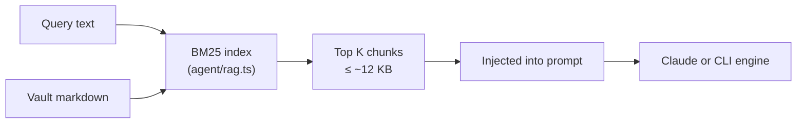

# RAG (Retrieval-Augmented Generation)

RAG sends the model only the slices of your vault that matter for the current
question, instead of letting the agent read the whole vault or dumping every file
into the prompt. Fewer input tokens, same grounding.

## The toggle

Every tab has a **RAG** checkbox next to **YC**. There's also a global default in
**Settings → "Use RAG retrieval by default"**; new tabs inherit it, and each tab
can still flip its own toggle. When RAG is active for the running tab, a **RAG**
chip shows in the top bar.

## What it does

When RAG is on, before drafting the app:

1. Builds (or reuses a cached) index of your vault.
2. Scores every chunk against the query:
   - **Ask mode** — the question alone.
   - **Job mode** — job description + question combined.
3. Injects the top handful of chunks (~12 KB budget) into the prompt as the only
   source of facts.

For the **Claude** engine, RAG also disables the `Read`/`Grep`/`Glob` tools for
that run, so the agent can't wander the vault — it answers from the injected
excerpts. For **CLI engines**, the retrieved excerpts replace the usual
whole-vault dump.

The retrieved excerpts show up in the tab's **Context activity** log, so you can
see exactly which files and headings were used.

## How retrieval works

It's [BM25](https://en.wikipedia.org/wiki/Okapi_BM25) lexical retrieval,
implemented in pure TypeScript on Bun (`agent/rag.ts`). No embeddings service, no
API keys, no model downloads, nothing to install.

- **Chunking** — markdown is split on headings; long sections are windowed with a
  little overlap. Each chunk keeps its file path and heading as metadata.
- **Scoring** — standard BM25 (`k1 = 1.5`, `b = 0.75`) with a small stopword list.
- **Indexing** — the index is cached per vault and rebuilt only when a file's
  path, size, or mtime changes, so repeated generations don't re-scan the vault.
- **Budget** — up to 8 chunks or ~12 KB, whichever comes first.

## When to use it

- **Turn it on** for large vaults, when you want to cut token usage, or when you
  want deterministic, inspectable context (you can see what was retrieved).
- **Leave it off** when you want the agent to explore freely, or for questions
  whose relevant facts are spread thin and hard to match by keyword.

Write mode does not use the RAG toggle — it gathers vault context directly for
summarize, auto-place, and fill-in operations.

## Graceful fallback

If retrieval finds nothing for a query (e.g. an empty vault or a question with no
matching terms), RAG steps aside: Claude falls back to reading the vault and
CLI engines fall back to the whole-vault dump, with a notice in the UI.

## Tuning

The defaults live as constants in `agent/rag.ts`:

- `MAX_CHUNK` / `WINDOW_OVERLAP` — chunk size and overlap.
- `topK` / `maxBytes` (in `retrieveContext`) — how many excerpts and how big a
  budget. These are passed from `agent/runner.ts`.
- `STOP` — the stopword list.
