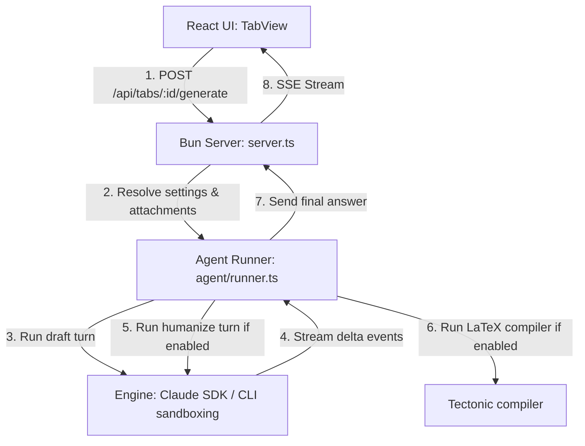

# Architecture overview

This document details the Vault Assistant process model, request lifecycle, and engine execution structure.

## Process model

The application runs as a single Bun process. 
- The server entrypoint is `server.ts`. It resolves the environment variables, reads the configuration, and sets up the router.
- The same process serves the React static files, hosts the JSON/SSE API routes, and runs the agent pipeline in `agent/runner.ts`.
- Long-running generation runs stream chunks back to the client using Server-Sent Events (SSE).

This single-process design eliminates the need for separate frontend and backend build pipelines or local databases.
- Global configuration persists to `config.json` in your user data directory or workspace root.
- Active session IDs persist to `.sessions.json`.
- Durable activity logs are appended to `logs/activity.jsonl`.

---

## Request lifecycle

When you click **Generate** or send a follow-up message:

1. **UI Layer:** The browser sends the prompt text, settings overrides, active attachment IDs, and selected skills list.
2. **Server Layer:** The server merges global settings with tab-specific overrides, resolves attachment records, and opens an SSE stream.
3. **Pipeline Layer:** The runner executes the configured steps:
   - **Draft phase:** The server calls the selected engine (using the Claude SDK or a sandboxed CLI) to write the grounded draft.
   - **Humanize phase:** If enabled, the server feeds the draft back to the model with instructions to remove AI writing patterns.
   - **LaTeX phase:** If active, the compiler finishes the run by rendering a PDF.
4. **Streaming Output:** The server translates progress updates and text deltas into client events (such as `phase`, `text`, `activity`, `notice`, and `done`) and streams them to the browser.

---

## Execution engines

The application supports two ways to execute models:

### Claude Code SDK

The default engine uses the Anthropic Agent SDK (`@anthropic-ai/claude-agent-sdk`). It connects directly to the Claude API using your local credentials. 

By default, the agent has access to local file-browsing tools (`Read`, `Grep`, and `Glob`). It scans the vault directory dynamically to find files matching your query. When RAG is active, the server disables these file-browsing tools. It passes the retrieved snippets in the prompt, preventing the agent from reading other parts of your filesystem.

### CLI engines

When using non-Claude engines (such as Gemini, OpenCode, Cursor, Copilot, or Codex), the server executes them via the command line.

- **Sandbox isolation:** The server creates an isolated, empty temporary directory. It spawns the CLI process inside this temporary folder. The CLI receives no access to your vault filesystem.
- **Context injection:** The server walks your vault directory (or retrieves RAG snippets), bundles the text contents, and injects the text directly into the CLI process standard input.
- **Session management:** Engines that support conversation history receive session IDs to continue threads across follow-up queries.
