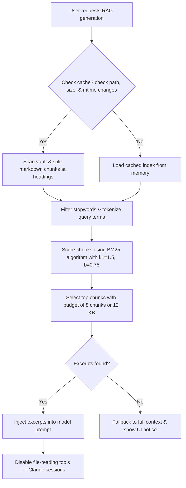

# Retrieval-Augmented Generation (RAG)

Retrieval-Augmented Generation (RAG) sends only the relevant slices of your vault to the model for each query. This limits token usage while keeping answers grounded in your notes.

## High-level features

- **RAG toggle:** Every tab contains a **RAG** checkbox. New tabs inherit the global default set in **Settings** -> **Retrieval**. You can still toggle RAG on or off for individual tabs.
- **RAG status chip:** When RAG is active for a generation, a **RAG** chip appears in the status bar at the bottom of the window.
- **Context activity log:** When the model finishes generating, the **Context activity** panel lists the exact files and headings retrieved from your vault.

The retrieval defaults live on the RAG / Retrieval page in Settings:

---

## Low-level mechanisms

The retrieval system is implemented in pure TypeScript in `agent/rag.ts`. It runs entirely inside the Bun server process and does not require external databases or API keys.

### Indexing and caching

1. When a generation begins with RAG enabled, the server scans your vault directory.
2. The indexer reads markdown files and splits them into text chunks. It splits files at markdown heading boundaries. For very long sections, it uses a sliding window with a small overlap to preserve context across boundaries.
3. The server caches the index structure in memory. It compares file sizes and modification times (mtimes) on subsequent runs. It re-indexes only the files that you have modified since the last run.

### Scoring and selection

The engine uses the BM25 lexical ranking algorithm to score chunks against your question and job description:
- The default configuration uses standard parameters (`k1 = 1.5`, `b = 0.75`).
- It filters out common stopwords to focus on unique terms.
- The retrieval budget selects the top-scoring chunks up to a maximum of 8 chunks or 12 KB of total text.

### Prompt injection and tool restrictions

Once the chunks are selected:
- For CLI engines, the server replaces the full vault file dump with the retrieved excerpts in the prompt.
- For Claude Code, the server disables filesystem tools (like `Read`, `Grep`, and `Glob`) for that session turn. It injects the excerpts into the prompt, forcing the model to answer using only the provided text.

### Graceful fallback

If retrieval returns no results (for example, if you query an empty vault or search for terms that do not match your notes), the system falls back to the default behavior. Claude Code regains access to its filesystem tools, and CLI engines receive the standard full-vault dump. The interface displays a warning message explaining that it fell back to the full context.
