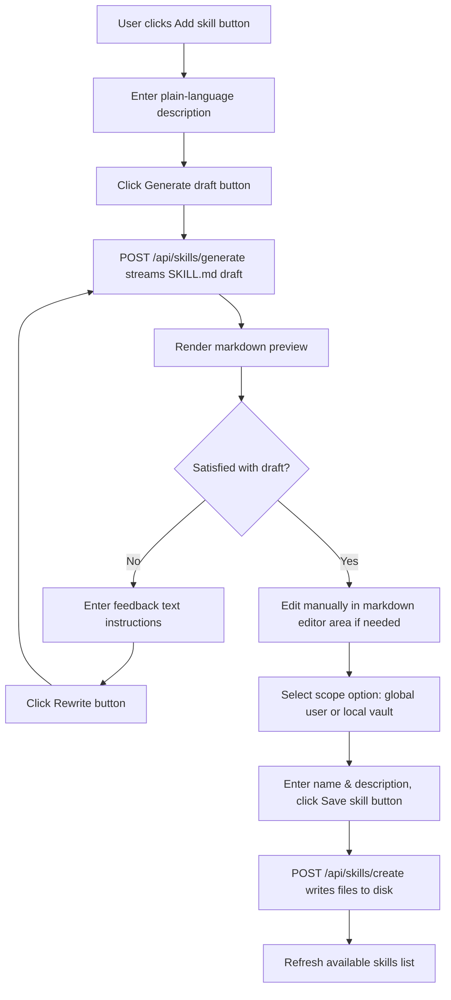

# Settings panel features

The settings panel allows you to customize default models, vault directories, persona prompts, visual themes, and custom skills. Clicking the gear icon (**⚙**) in the top right header opens the drawer.

---

## Left navigation pages

The panel organizes options into nine sub-pages:

### General page

Customize default tab settings and startup preferences:
- **Default Tab Mode selector:** Choose whether new tabs open in Ask mode or Drafting mode by default. Low-level action: sets the `jt.defaultmode` key in `localStorage` to `ask` or `job`.
- **Default Engine and Model selector:** Select the default engine and model. Low-level action: updates `settings.engine` and `settings.model`.

### Vault page

Configure vault folder paths and validate folder contents:
- **Vault Directory path picker:** Input the absolute path of your local vault. Low-level action: updates `settings.vaultDir`.
- **Choose directory button:** Opens your host operating system's native folder picker. Low-level action: calls `GET /api/dialog/select-dir` to launch the native dialog, returning the selected path.
- **Validate Vault button:** Click to verify if the path is a valid directory. Low-level action: calls `GET /api/vault/validate` to inspect folder contents, returning a list of top-level folders.
- **Extra Directory inputs:** Add or remove paths to search for skills or extra context files. Click the **+** button to add a path, and click the trash can icon to remove a path. Low-level action: updates `settings.extraDirs`.

### Persona page

Modify the system prompts used during generation:
- **Drafting Persona textarea:** Define the persona and rules for Drafting mode. Low-level action: updates `settings.persona`.
- **Ask Persona textarea:** Define the persona and rules for Ask mode. Low-level action: updates `settings.askPersona`.
- **User Profile inputs (Name, Role, Voice Notes):** Type your details to generate default personas. Low-level action: calls `buildJobPersona` and `buildAskPersona` to update the prompt fields.

### AI Engine page

Audit system executables and select model targets:
- **Default Engine selector:** Select active global engine.
- **Model selector:** Select active global model.
- **Effort selector:** Select active global reasoning budget.
- **Cleanup Model selector:** Select model used for formatting/cleanups.
- **Cleanup Effort selector:** Select reasoning budget for cleanups.
- **Rescan paths button:** Click to audit installed CLI engines. Low-level action: calls `GET /api/engines/scan` to search the system `PATH` for executables (like `agy` or `opencode`), updating available models in the dropdowns.

### RAG / Retrieval page

Configure default retrieval settings and web crawlers:
- **Use RAG by default checkbox:** Toggles whether new tabs enable RAG. Low-level action: updates `settings.rag`.
- **Local web research checkbox:** Toggles model search and page read capabilities. Low-level action: updates `settings.webResearchEnabled`.
- **Web research crawler selector:** Choose Readability, Auto, or Chromium modes. Low-level action: updates `settings.urlFetchMethod`.
- **Local SearXNG URL input:** Enter your SearXNG loopback address. Low-level action: updates `settings.searxngUrl`.

### Skills page

Install, search, or create custom skills:
- **Search field:** Type text to filter the list of installed skills.
- **Add skill button:** Click to open the skill creator dialog.
  - **Describe skill textarea:** Type a prompt describing the skill rules. Low-level action: updates `skillDescribe`.
  - **Generate draft button:** Click to stream a draft `SKILL.md`. Low-level action: POSTs to `/api/skills/generate` to stream the guide using the model.
  - **Feedback textarea:** Type refinement instructions.
  - **Rewrite button:** Click to update the draft. Low-level action: POSTs feedback to `/api/skills/generate` to rewrite the document.
  - **Name input:** Enter the folder and skill name.
  - **Description input:** Enter a brief summary of the skill.
  - **Markdown editor area:** Edit the final `SKILL.md` body.
  - **Scope selector (User / Vault):** Choose whether to install the skill globally or inside the active vault.
  - **Save skill button:** Click to save the file. Low-level action: POSTs to `/api/skills/create` to write the directory and markdown file.

### Appearance page

Tweak the design system layout and variables:
- **Theme selectors:** Toggle dark or light modes.
- **Density selectors:** Toggle cozy or tight layouts.
- **Font selector:** Select default display font family. Low-level action: sets `data-font-family` on the `<html>` element.
- **Font scale slider:** Drag to change text size. Low-level action: sets the `--font-scale` variable on the root CSS.
- **Accent Hue slider:** Drag to change the accent tint color. Low-level action: sets the `--accent-hue` OKLCH variable on root CSS.
- **Accent Chroma slider:** Drag to change color saturation. Low-level action: sets the `--accent-chroma` OKLCH variable on root CSS.
- **Border radius selector:** Toggle roundness settings. Low-level action: sets `data-radius` on `<html>`.
- **Spacing selector:** Toggle margin scales. Low-level action: sets `data-spacing` on `<html>`.
- **Shadow selector:** Toggle elevations. Low-level action: sets `data-shadow` on `<html>`.

### Logs page

View server events and clean log files:
- **Log list:** Scroll to read chronological server requests.
- **Clear logs button:** Click to empty the log history. Low-level action: calls `DELETE /api/logs` to clear `logs/activity.jsonl` on disk and resets the in-memory array.

### Getting started page

Read the onboarding guide and help documentation. Low-level action: renders the static help copy.
