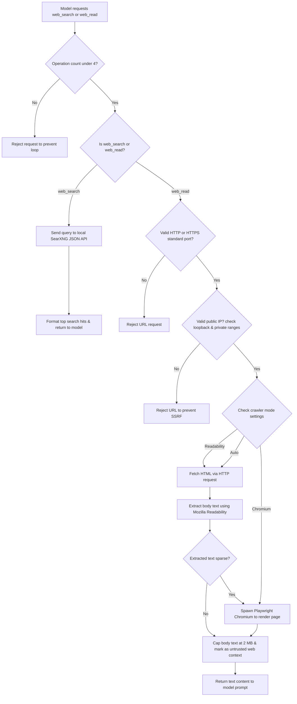

# Local web research

Vault Assistant can grant Claude Code and local CLI engines search and page-reading capabilities without requiring paid APIs. This feature is disabled by default.

## Setup requirements

To run local web research:
1. Run a local SearXNG search engine instance (usually in Docker).
2. Enable JSON format output in SearXNG's `settings.yml` file.
3. In **Settings** -> **Retrieval**, enable local web research and set the SearXNG URL to your local address (like `http://127.0.0.1:8080`).
4. To parse pages that require JavaScript, install Playwright's browser files:
   ```bash
   bunx playwright install chromium
   ```

---

## Low-level mechanisms

The web research capability is managed in `agent/web.ts`. 



### Bounded tool execution

The model does not receive direct network access. Instead, the model outputs structured XML or JSON requests requesting a search (`web_search`) or page read (`web_read`).

The application intercepts these requests and enforces the following limits:
- A model can perform at most four web operations per answer.
- Search queries are sent to the configured local SearXNG API.
- Page reads are resolved using one of three crawler modes configured in settings.

### Crawler modes

- **Readability:** Fetches page HTML using raw HTTP requests and extracts the main body text using Mozilla Readability. This is the fastest mode.
- **Auto:** Attempts to use the fast Readability parser first. If the resulting text is sparse, it falls back to Playwright Chromium to render the page.
- **Chromium:** Spawns a headless Playwright Chromium instance for every page read. Use this mode for sites that rely on JavaScript execution.

### Security and SSRF protection

To prevent Server-Side Request Forgery (SSRF) and protect local networks:
1. The resolver allows only public `http` and `https` protocols on standard ports (80 and 443).
2. It resolves redirect destinations and checks them against a blocklist.
3. It rejects loopback addresses (like `127.0.0.1` or `localhost`) and private IP ranges (like `10.0.0.0/8` or `192.168.0.0/16`).
4. It caps response body sizes at 2 MB to prevent memory overflow.
5. It marks all retrieved web content as untrusted text before injecting it into the model prompt.
