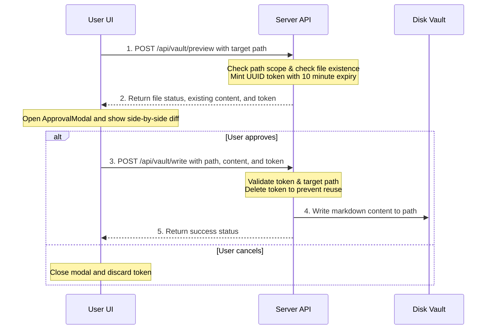

# Write to vault features

The **Write to vault** mode lets you add, modify, or format files inside your local vault. Rather than letting the model write files directly, the application uses a secure approval pipeline. Nothing is saved to disk until you review the changes and approve them.

---

## The write approval flow

Every file write in the application goes through the approval flow:

1. **Write Trigger:** Clicking any button to write content (like **Write to Vault** or **Confirm & Write**) triggers the write preview.
2. **Preview Request:** The browser sends a POST request to `/api/vault/preview` with the vault-relative target path.
3. **Exist Check & Token Minting:** The server verifies the path. If the file exists, it reads the content to generate a diff. The server also mints a random, one-time security token that expires after 10 minutes. The server returns the file status, existing content, and the token to the browser.
4. **Diff Modal:** The interface opens the `ApprovalModal` showing a side-by-side diff of the existing file and the proposed changes.
5. **Approve button:** Click this button in the modal to finalize the write. The browser sends the new content and the security token to `POST /api/vault/write`. The server checks the token, writes the file to disk, and deletes the token to prevent reuse.
6. **Cancel / Close button:** Click this button or press `Esc` to close the modal. This releases the token without modifying the file.

---

## Write mode sub-tabs

Each tab in Write mode (sets `tab.mode = "write"`) opens the `VaultWriter` panel. It features a mode-switch selector containing four sub-tabs:

### Summarize tab

Use this tab to condense long articles, papers, or web pages into a markdown note:

1. **Source Content or URL textarea:** Paste long text or type a web address starting with `http://` or `https://`. Low-level action: updates `tab.writeInput` in state.
2. **Summarize button:** Click this button to start the summary process. Low-level action: POSTs to `/api/tabs/:id/summarize`. If the input is a URL, the server uses SearXNG and Readability to fetch the page and extract the main article. The model then generates a structured markdown summary.
3. **Save Path picker:** Select or type the vault path where the summary should be saved. Low-level action: updates `tab.writePath` in state.
4. **Write to Vault button:** Located on the generated summary preview card. Click this button to trigger the write approval flow.

### Manual tab

Use this tab to write or edit vault entries by hand, with assistance from formatting and path suggestion tools:

1. **Target Path picker:** Select or type the vault path where the note should be saved. Low-level action: updates `tab.writePath` in state.
2. **Content textarea:** The markdown editor area where you type the note content. Low-level action: updates `tab.writeInput` in state.
3. **Clean up / Format button:** Click this button to clean up your note. Low-level action: POSTs to `/api/tabs/:id/write-cleanup`. The model corrects grammar, refines the layout, and applies any active skills. It displays the result in a preview panel.
4. **Auto-place button:** Click this button to get a recommended file path. Low-level action: POSTs to `/api/tabs/:id/auto-place`. The model reviews your note and your vault's directory structure to suggest the most appropriate folder and filename.
5. **Use this button:** Located on the formatted preview card. Click this button to overwrite your editor text with the model's cleaned-up draft.
6. **Write to Vault button:** Click this button to open the approval modal and write your note to your chosen target path.

### Fill-in tab

Use this tab to scan your vault for missing information and draft entries to fill those gaps:

1. **Focus Area textarea:** Type instructions to focus the gap scan (like "Find missing projects in my portfolio"). Low-level action: updates `tab.writeInput` in state.
2. **Directory Scope picker:** Select a folder to limit the scan. Low-level action: updates `tab.fillinDir` in state. Leaving this blank scans the entire vault.
3. **Scan Vault for Gaps button:** Click this button to scan your notes. Low-level action: POSTs to `/api/tabs/:id/fillin-scan`. The model analyzes your folder structure and notes to output a list of questions identifying missing context.
4. **Draft Entry button:** Located on each discovered gap card. Type a brief answer in the text box and click this button to send a POST request to `/api/tabs/:id/fillin-write`. The model drafts a complete, formatted markdown file.
5. **Edit Manually button:** Click this button on a drafted gap preview to move the text into the answer box for manual editing.
6. **Confirm & Write button:** Click this button to open the write approval flow and save the drafted entry to its target path.

### Document tab

Use this tab to upload a document and let the model propose updates or new files based on its contents:

1. **Choose PDF or DOCX button (or Replace document):** Click this button to select a local document. Low-level action: triggers a hidden file input. Selecting a file uploads it to `/api/attachments`. The server extracts the text and holds it in temporary storage.
2. **Focus textarea:** Type instructions to guide content placement (like "Propose updates to my Resume file"). Low-level action: updates `tab.writeInput` in state.
3. **Analyze & Propose button:** Click this button to start the document analysis. Low-level action: POSTs to `/api/tabs/:id/doc-propose`. The model reads the extracted text and outputs a list of write proposals. Each proposal includes an action type (create or update), a target path, the proposed content, and a rationale.
4. **Edit manually button:** Located on each proposal card. Click this button to toggle a text area so you can edit the proposed file content before saving.
5. **Dismiss button:** Click this button to reject a proposal. Low-level action: sets the proposal status to `rejected`, hiding it from the active list.
6. **Review & Write button:** Click this button to open the diff preview modal and write the proposal to your vault.
